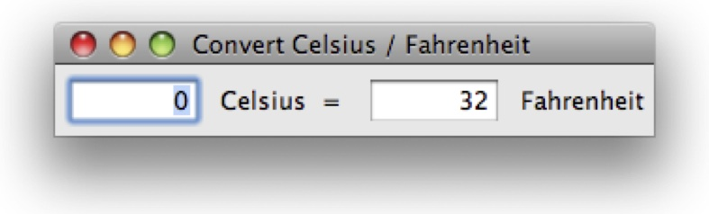
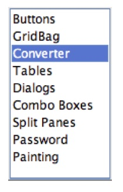
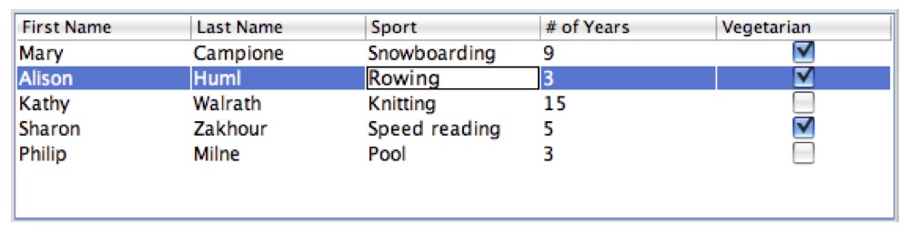
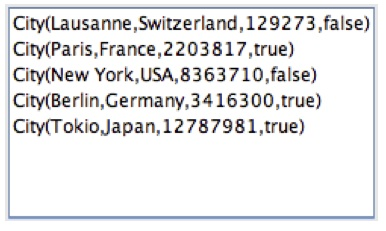

Original http://www.scala-lang.org/old/sites/default/files/sids/imaier/Mon,%202009-11-02,%2008:55/scala-swing-design.pdf

 **SIP-8 (Draft) -- Nov 2009**
 
 **The scala.swing package**

 **Ingo Maier**

 **November 1, 2009**


#1 Introduction

The scala.swing package provides a collection of thin wrappers around Java Swing classes. Our goal is to deliver a library that at the same time feels natural to use in Scala and that is sufficiently close to Java Swing to appeal to Java programmers with existing Swing experience.

This document provides a short introduction to programming Swing in Scala, an overview of the available classes in scala.swing and its design principles. We finish with guidelines that should be followed by library extenders when writing additional wrappers. Throughout this document, we will refer to examples in the scala.swing.test package that are part of the scala.swing distribution.

The reader should have at least basic Scala knowledge and some experience with Java Swing or similar GUI toolkits. For an introduction to Scala in general, we suggest to go to http: //www.scala-lang.org/node/1305. For a more comprehensive introduction including basics of scala.swing we recommend the book "Programming in Scala"[^0]. A good Java Swing tutorial can be found at http://java.sun.com/docs/books/tutorial/uiswing.

[^0]: Martin Odersky, Lex Spoon, and Bill Venners. Programming in Scala: A Comprehensive Step-by-step Guide. Artima Incorporation, USA, 2008.

#2 Getting started
The following example can be compiled as it stands to create a simple "Hello World" scala.swing program as depicted in Figure 1:

```
import swing._
object HelloWorld extends SimpleSwingApplication {
  def top = new MainFrame {
    title = "Hello, World!"
    contents = new Button {
      text = "Click Me!"
    }
  } 
}
```


Most simple scala.swing applications consist of a main object such as HelloWorld above that extends class SimpleSwingApplication{^1]. The main object needs to implement method top that takes no arguments and returns a Frame, or as in this case, a MainFrame. A frame is a standard operating system window with decorations such as a close button and a resize handle. A MainFrame is a frame that automatically quits the application when closed and is thus used by most applications that need only a single frame.

[^1]: Class SimpleSwingApplication replaces SimpleGUIApplication in Scala 2.8.

On startup, class SimpleSwingApplication takes care of initializing the Swing framework and opens the frame returned by method top. The above implementation creates a main frame using the standard scala.swing notation for member initialization. We are really creating an anonymous class with the following expression.

```
new MainFrame {
  title = "Hello, World!"
  contents = new Button {
    text = "Click Me!"
  }
}
```

Anonymous class syntax lets us access all members of class MainFrame inside the inner curly braces. We are setting the frame title property to the string "Hello, World!" and the contents of the frame to a simple click button that reads "Click Me!" and does nothing when clicked.

Many classes provide a small number of convenience constructors, which are similar to those provided by Java Swing and make component creation more concise. For the button in-stantiation above, we could have written
```
contents = new Button("Click Me!")
```

When setting a larger number of properties, however, it is generally preferable to use anonymous class syntax, since explicit naming of properties often makes scala.swing code more readable.

##2.1 Classes SwingApplication and SimpleSwingApplication

Class SimpleSwingApplication from above extends SwingApplication which implements
a default main method. It further provides the following three methods:

```
def startup(args: Array[String])
def quit() { ... }
def shutdown() { ... }
```
Method startup is called in the default main method implementation and needs to be implemented by clients. It is called on the Swing event dispatching thread. Method quit should be called to gracefully quit the application. It calls method shutdown as the last step before ultimately terminating the application. Method shutdown should be overwritten by clients who need to cleanup resources and run shutdown specific code.

Subclass SimpleSwingApplication provides a default implementation for method startup that shows the frame returned by the client’s implementation of method top.
Notice that our approach is similar to but simpler than the Java Swing Application framework as introduced at http://java.sun.com/developer/technicalArticles/javase/swingappfr/.


#3 Laying out components
Previously, we have seen how to add a button to a frame. For more complex layouts, we nest components inside containers that arrange their chid components according to specific rules. In scala.swing as well as in Java Swing, there are two types of container components: panes and panels. Panes show a fixed number of child components, potentially together with decora- tions specific to the respective pane. One example is a split pane that shows two components side by side horizontally or vertically with a knob inbetween that lets the user allocate more or less space for one or the other component. Another example is a scrollpane, that contains a single component inside a canvas with scroll bars.

Panels, on the other hand, are containers that arrange an arbitrary number of child compo- nents according to layout rules that are customizable by clients to a certain degree.

##3.1 A strongly typed, concise container interface
In Java Swing, containers are decoupled from specific layout managers. To create a Java Swing container, clients use the JPanel component together with a suitable layout manager, such as follows.

```
val panel = new JPanel()
panel.setLayout(new BorderLayout())
```
Components can be added with one of the add methods from the java.awt.Component base class:

```
def add(comp: Component, constraints: Object): Component
def add(comp: Component, index: Int): Component
def add(comp: Component,constraints: Object, index: Int): Component
```
Adding a button to the above panel with a BorderLayout manager looks as follows:

```
panel.add(new JButton("click me"), BorderLayout.CENTER)
```
The JPanel.add methods call the layout manager through a common interface to make a given component and its layout constraints available.
Different from Java Swing, containers and layout manager in scala.swing are coupled. This allows for an interface that is more concise and catches more type errors at compile time. In Java Swing, layout constraints can only be of type Object or Int as dictated by the add methods’ interface above. A generic panel class that takes its layout manager and constraints type as a type argument could cater for a better typed but also more complex interface:

```
class JGenericPanel[L <: LayoutManager[C],
                    C <: LayoutConstraint] extends JComponent {
  protected def layout: L
  def add(comp: Component, constraints: C) = {
    ...
    layout.addLayoutComponent(comp, constraints)
    ...
  } 
}
```
Furthermore, by using object composition for layout managers and containers we do not gain any flexibility, as changing a layout manager inevitably results in resetting incompatible constraints for every child component. This results in the same amount of work as creating a new container and readding all child components.

The above two arguments have led us to the following unified layout container interface:

```
trait LayoutContainer extends Container.Wrapper {
  type Constraints <: AnyRef
  val layout: Map[Component, Constraints] = ...
  protected def constraintsFor(c: Component): Constraints
  protected def areValid(c: Constraints): (Boolean, String)
  protected def add(comp: Component, c: Constraints)
}
```
Components can be added to the layout map that associates them to their constraints, which are of type Constraints.

##3.2 Extending LayoutContainer
Concrete subclasses of LayoutContainer need to fix the abstract Contraints type and implement three additional methods to connect the wrapper to the underlying peer:

*  **constraintsFor(c: Component): Constraints** obtainsthecurrentconstraintsforthegiven component
* **areValid(c: Constraints): (Boolean, String)** performsaruntimechecktodetermine whether the given  constraints are valid, and if not, provides an optional error message
* **add(comp: Component, c: Constraints)** adds the given component with the given constraints to this container

Subclass BorderPanel, for instance, assigns the Contraints type to a custom Position enumeration and obtains the constraints from the underlying layout manager while perform- ing some casting operations. As there are only valid Position enumeration values, method areValid does not need to perform any runtime checks and thus always returns (true,""). Adding a component to a BorderPanel is, as in most cases, trivial and simply calls a JPanel.add method with the appropriate arguments:


#4 Reacting to events
Observing and reacting to events in scala.swing is based around the concepts of publishers and reactors. Any scala.swing component is automatically both a publisher that publishes events and a reactor that reacts to events. Let’s have a look how a simple Celsius to Fahrenheit converter as depicted in Figure 2 could be implemented.

First, we first create a frame with two identical text fields where the user can enter degrees in Celsius and Fahrenheit:




```
object Converter extends SimpleSwingApplication {
  def newField = new TextField {
text = "0"
columns = 5 }
  val celsius = newField
  val fahrenheit = newField
  def top = new MainFrame {
    title = "Convert Celsius / Fahrenheit"
    contents = new FlowPanel(celsius, new Label(" Celsius  =  "),
                             fahrenheit, new Label(" Fahrenheit"))
  } 
}
```
A text field is a publisher of events of type EditDone indicating that the user has just finished editing the field. In order to react to those events, we need to add reactions to a reactor listening to our text fields. We can put the following code inside our main object Converter extending SimpleSwingApplication which is an application global reactor per default:

```
listenTo(fahrenheit, celsius)
reactions += {
  case EditDone(‘fahrenheit‘) =>
    val f = Integer.parseInt(fahrenheit.text)
    val c = (f - 32) * 5 / 9
    celsius.text = c.toString
  case EditDone(‘celsius‘) =>
    val c = Integer.parseInt(celsius.text)
    val f = c * 9 / 5 + 32
    fahrenheit.text = f.toString
}    
```

We first indicate that our main object is interested in events from each text field by call- ing method listenTo from class Reactor, which is a base class of SimpleSwingApplication. Then we add two reactions to EditDone events from text field celsius and text field fahrenheit that each update the contents of the other text field that has not been edited. Events are usually case classes or classes with extractors, so that clients can easily pattern match on them as in the example above.

The complete source code for this example can be found in the scala.swing test package.

##4.1 Java Swing Listeners versus scala.swing Reactions
As we have seen above, events in scala.swing are dispatched in pattern matchings. As each event is a normal Scala object, it has a unique type, which determines how to pattern match on it. Contrast this to Java Swing, where some events are dispatched in two phases, according to their type plus an additional listener method. The following example shows how to listen to mouse click events in Java Swing.

```
new JComponent {
  addMouseListener(new MouseAdapter {
    @Override
    def mouseClicked(e: MouseEvent) {
      System.out.println("Mouse clicked at " + e.getPoint)
    }
  }) 
}
```
Note that we are using the convenience class MouseAdapter, which implements all methods
from interface MouseListener, in order to avoid implementing the other methods from MouseListener. This interface is one example were we first dispatch on the event’s Java type (MouseEvent)
and then refine the match by implementing one of the listener’s methods which all take the
same parameter (using listener MouseListener and method mouseClicked). The equivalent
in scala.swing, which matches on the event’s type, looks as follows.

```
new Component {
  listenTo(mouse)
  reactions += {
    case e: MouseClicked =>
      println("Mouse clicked at " + e.point)
  } 
}
```
For efficiency reasons, mouse events are not published by a component itself, but by its member mouse. Therefore, we first have to listenTo the mouse publisher.

##4.2 Publishers and Reactors
The entire publish/react system is implemented in classes Publisher, Reactor, and Reactions. For API users, the only interesting method in Publisher is
```
def publish(e: Event)
```
which notifies all registered reactors. The sole purpose of trait Event for now is to indicate that some class defines an event. To make an object a publisher, simply extend class Publisher and call the above method to publish events. A reactor can be registered and deregistered to one or more publishers with the following methods in class Reactor:
```
def listenTo(ps: Publisher*)
def deafTo(ps: Publisher*)
```
The third interesting member of class Reactor is
```
val reactions: Reactions
```
which represent a collection of reactions. A reaction is an object of type Reactions.Reaction, which is an alias for PartialFunction[Event, Unit]. We have seen how to add reactions with the method += above. The other interesting method -= of class Reaction removes a pre- viously registered reaction. Both method return the receiving reactions object:

```
def +=(r: Reactions.Reaction): this.type
def -=(r: Reactions.Reaction): this.type
```
This fact allows clients to syntactically concatenate additions and removals of single reactions.

##4.3 Actions
Java Swing provides an interface javax.swing.Action which encapsulates code to be exe- cuted as a reaction to an event. Different from a listener, though, an action also captures infor- mation that can be useful for several types of user interface components. Often used properties are an action’s name that usually manifests itself as a button’s or menu item’s title and an action’s mnemonic key which is used as a keyboard shortcut for various kinds of buttons and menu items. See http://java.sun.com/docs/books/tutorial/uiswing/misc/action.html for a complete list of an action’s properties.

In scala.swing, we represent actions by the Action trait that is wrapper around it’s Java Swing peer similar to components. The Action companion object defines several convenience members. The following method lets clients create actions very conveniently.

```
def apply(title: String)(block: =>Unit) = new Action(title) {
  def apply() { block }
}
```
We can create an action by writing:

```
Action("Run me") {
  println("Someone executed this action.")
}
```
A component that can be associated with an action extends trait Action.Triger. The fol-
lowing shows one way to associate a click button with an action.

```
val button = new Button {
  action = Action("Click me") {
    println("Someone executed clicked button " + this)
  }
}
```
As it is very common for buttons to have actions, there is a convenience factory method in companion object Button. The following is equivalent to the previous example.

```
val button = Button("Click me") {
  println("Someone executed clicked button " + this)
}
```
A component with an action can use as much information from that action as it wants. Buttons and menu items usually use their action’s body, name, accelerator key, icon and so on, whereas a text field might use the action’s body only. To tell a component that it does not have an associated action, one must use the Action.NoAction object which is the default value for a component’s action.

```
button.action = Action.NoAction
```
A component with a NoAction uses it’s own properties instead of those of the action. In Java
Swing, the equivalent to NoAction is null.

#5 List Views and Tables

List views and tables are components that show an arbitrary number of items in a uniform arrangement. List views show them in a simple horizontal or vertical arrangement, each item often rendered as a simple string, as depicted in Figure 5. Tables arrange elements in a grid and optionally show row and column headers as depicted in Figure 6.

##5.1 Class ListView

Class ListView has a convenience constructor that takes a sequence of items. A list view can
be instantiated as follows:

```
val items = List("Lausanne", "Paris", "New York", "Berlin", "Tokio")
val view = new ListView(items)
```






In contrast to Java Swing, ListView and its constructor are polymorphic in the type of items:

```
class ListView[A] extends Component {
  def this(items: Seq[A]) = ...
... 
}
```
ListView defines a member selection that lets clients query information about the current selection, for instance, the sequence of currently selected items. In order to see how we can take advantage of class ListView being generic, we modify the above example slightly:

```
case class City(name: String, country: String, population: Int, capital: Boolean)
val items = List(City("Lausanne", "Switzerland", 129273, false),
                          City("Paris", "France", 2203817, true),
                          City("New York", "USA", 8363710 , false),
                          City("Berlin", "Germany", 3416300, true),
                          City("Tokio", "Japan", 12787981, true))
val view = new ListView(items)
```
We can now query the currently selected items and receive a sequence of City objects we
can immediately operate on:
```
val cityNames = view.selection.items.map(_.name)
```
In Java Swing, we would have to perform casts or go through the list of selected indices, both leading to more error-prone and less concise code.

##5.2 Renderers

If we actually take the list view code showing city objects from above, and put it inside a frame we will get the result shown in Figure 7.



The reason is that by default, a list view calls toString on its items and displays each as a
label containing that string. Since for a case class such as City, method toString returns a string composed of the class name and its constructor arguments, we see the result as depicted in Figure 7.

Technically, class ListView uses an instance of class ListView.Renderer to render each item. Companion object ListView contains a number of renderer related member that are useful to clients. Object GenericRenderer is just a wrapper for the default renderer imposed by Java Swing and calls toString for each item as mentioned above.

Companion object Renderer defines the following composition method:

```
def apply[A,B](f: A => B)(implicit renderer: Renderer[B]): Renderer[A]
```
It returns a renderer for item types A that uses an implicitly supplied renderer for item types B. The resulting renderer obtains items of type B by applying function f to each item. Using this function and the implicit GenericRenderer object, we can create a better city view:

```
import ListView._
val view = new ListView(items) {
  renderer = Renderer(_.name)
}
```

The last useful class from object ListView is class AbstractRenderer that can be used to create more elaborate item views. Its constructor takes a component whose paintComponent method used to draw an item:

```
abstract class AbstractRenderer[-A, C<:Component](protected val component: C)
               extends Renderer[A]
               
```
Clients need to configure that component for each item by implementing the following method:

```
def configure(list: ListView[_], isSelected: Boolean, focused: Boolean,
              a: A, index: Int)
              
```
Method configure for a view showing items of class Item could be implemented as follows:

```
def configure(list: ListView[_], isSelected: Boolean, focused: Boolean,
         icon: Icon, index: Int) {
  component.icon = icon
  component.xAlignment = Alignment.Center
  if(isSelected) {
    component.border = Swing.LineBorder(list.selectionBackground, 3)
  } else {
    component.border = Swing.EmptyBorder(3)
  }
}
```
A similar example can be found in the combo boxes demo from the sample package.

##5.3 Class Table

The design of class Table and its renderers are similar to that of ListView and its renderers. Class Table, however, is not tailored to a specific usage pattern and can be used to show lists of items as well as more general grid data structures such as a two dimensional array, for instance in a spreadsheet. Hence, an item for a Table could represent a row, a column, or single cell. Consequently, class Table is not generic.

In the future, we might add a generic ListTable class tailored to lists of items similar to cass ListView but in a layout with multiple columns.

#6 Custom Painting

Custom component painting in scala.swing is very similar to Java Swing. Most users that want to perform custom painting inside a component will want to instantiate Component or one of its subclasses and override method paintComponent. Here is how it is done in the LinePainting demo from the scala.swing sample package:

```
new Component {
  ...
  override def paintComponent(g: Graphics2D) = {
    super.paintComponent(g)
    g.setColor(new Color(100,100,100))
    g.drawString("Press left mouse button and drag to paint.",
                 10, size.height-10)
    g.setColor(Color.black)
    g.draw(path)
  }
}
```

This calls super.paintComponent() to make sure the component draws its background and decorations properly. It then draws a custom string and a path that is maintained by the demo while the user drags the mouse.

The available paint methods provided in class Component are

```
protected def paint(g: Graphics2D)
protected def paintBorder(g: Graphics2D)
protected def paintChildren(g: Graphics2D)
protected def paintComponent(g: Graphics2D)
```
Method paint is called by the Swing painting mechanism to draw a component and in its standard implementation invokes the other three methods to paint the component spe- cific decorations, its border, and its children, respectively. Note that these methods take a Graphics2D object in contrast to corresponding methods in javax.swing.Component which take the Graphics object. Internally, Swing deals with Graphics2D objects in any event. The scala.swing signatures eliminate the need to perform the common cast g.asInstanceOf[Graphics2D] to access the newer interface of class Graphics2D.

For an introduction to custom painting visit http://java.sun.com/docs/books/tutorial/ uiswing/painting/index.html. A comprehensive introduction to the Swing graphics API, such as the Graphics2D and ancillary classes, can be found at http://java.sun.com/docs/ books/tutorial/2d/index.html. Details about the AWT and Swing painting mechanism are discussed at http://java.sun.com/products/jfc/tsc/articles/painting/.

##6.1 Customizing by overriding methods


Custom drawing is just one example of the more general technique of customizing classes by overriding method. For this technique to work in our wrapper library, we perform method del- egation and mixin composition when instantiating peers.

The implementation for the paint method in class Component is done as follows. Class Component defines the following trait:

```
protected trait SuperMixin extends JComponent {
  override def paint(g: Graphics) {
     Component.this.paint(g.asInstanceOf[Graphics2D])
  }
  def __super__paint(g: Graphics) {
    super.paint(g)
  } 
}
```

This trait is used to redirect calls to the peer’s paint method to the wrapper’s paint method and expose the original paint method through __super__paint. To do so, class Component mixes the SuperMixin trait into its peer:

```
override lazy val peer: javax.swing.JComponent =
  new javax.swing.JComponent with SuperMixin
  
```

The default implementation of method paint in class Component calls the original paint method of its peer:

```
def paint(g: Graphics2D) {
  peer match {
    case peer: SuperMixin => peer.__super__paint(g)
    case _ => peer.paint(g)
  }
}
```

To avoid a cycle, it calls the __super__paint method when the mixin is present, i.e., when the
peer has been created by scala.swing. Otherwise it simply calls the peer’s paint method.

For private and protected methods such as paintComponent, we cannot call the peer method. We have to drop the second case in the implementation of Component.paint above. As a consequence, for a wrapper that has been created for an existing Java Swing component, such a method would do nothing.

#7 Guidelines for Writing Wrappers

The previous sections gave an overview on scala.swing’s fundamental design principles. This section enumerates and summarizes a number of points to consider when writing new wrap- pers. Refer to the given sections for details.

* **Stay close to Java Swing** The first and most important rule is not to be too clever. Staying close to the original design gives developers familiar with Java Swing a head start. Start with a wrapper class per peer. Properties should keep the same names whenever possible. Java getters and setters (methods starting with get, set, or is for booleans) should be trans- lated to a corresponding pair of Scala getters and setters to make use of the convenient assignment syntax and the uniform access principle. Other methods should be just del- egates that do necessary wrapping and unwrapping of peers and wrappers. Depart from this rule only if there is good reason to do so (for examples see the following points).

* **Extract common interfaces** Some Swing classes share a common API which is not represented by a Java interface or base class. One example is the subhierarchy of window classes which share common methods but which do not extend each other but different AWT classes (See ?? for details). Use a trait or an (abstract) base class to factor out a common interface but also common wrapper code (??).
Use peer mixins to let peers conform to a required interface (??). Use traits if you always have control over the peer creation; use structural types as in scala.swing.Oriented if you do not.

* **Use the super mixin pattern for overridable methods** If a class can be customized by overriding certain methods such as in custom component painting (6), create a peer mixin that overrides the desired methods each delegating to the respective wrapper method. Supply a method that lets the wrapper access the original peer method for the default wrapper implementation (6.1).

* **Use abstract and implementation trait pairs** Traits that custom widgets can implement in Scala should stay abstract. For a default implementation that delegates to its Java Swing peer, create a trait called Wrapper in the companion object. See Container and Scrollable for examples.

* **Integrate with Scala collection API** Java Swing is poorly integrated with Java’s standard collections. We aim to do better. Use a Scala collection wherever appropriate. This gives the programmer two advantages. First, he can use a powerful API he already knows, and sec- ond, he can use components or component members with other APIs that expect a Scala standard collection. See the container classes in scala.swing for examples.
If there is no collection available that entirely suits your needs, subclass an existing collection instead of creating your custom interface, for the same reasons as given above.

* **Use generic types and member types** Generic types and abstract member types can lead to more type safety and, when used appropriately, to a more convenient and uniform API. Uniform item containers such as lists and combo boxes are ideal examples for generic types, whereas a table is a debatable example. We have chosen flexibility and simplicity over type safety for the standard Table class, which does not preclude the possibility for sensible but more restricted forms of type-safe tables.
Member types are sometimes preferable over type parameters because they can lead to more concise type signatures, e.g., if the member type needs not to be refined at use site[^2]. They are preferable for layout containers, as the precise constraints and their meaning are bound to single, concrete subclasses of LayoutContainer (3.1). In other words, it does not make much sense to talk about "a layout container with BorderPanel.Position constraints" in general if there is only a single conforming base class, i.e., BorderPanel.
Type parameters are preferable for combo boxes and lists, because we want the compiler infer the item type on construction. This is not possible with member types, as we cannot refer to member types in constructor arguments.
You might balance the reasons carefully, before using complex types or more sophisticated type system features of Scala, such as path dependent types. We haven’t found such features very useful in the context of a traditional style GUI toolkit such as scala.swing.

[^2]: If this would be a common case, then we would always have to write MyClass { type Param <: Arg } for member types instead of just MyClass[Arg] for generic types


* **Provide convenience constructors or factories** Provide convenience constructors for components that are usually created by setting a small number of properties. Avoid named arguments if the meaning of arguments are clear from their position and type. A single con- structor taking a sting and an integer is okay, a constructor taking three strings is most likely not.
Provide factory methods if it makes sense to pass a closure as the last argument such as for scala.swing.Action. Constructors are generally preferable, though, since they allow to mix a convenience constructor with anonymous class syntax.

* **Convert flags to enumerations** Use enumerations where Java Swing uses integer flags. Reuse existing enumerations from scala.swing such as Orientation or Alignment.

* **Use the wrapper cache** Never store wrappers yourself. This can quickly lead to memory leaks. Use the built-in caches. Provide a cache method in your wrapper’s companion object (??).

* **Consider creating designated "null" objects for your classes** Never use null in a public interface. Before considering Option as an alternative, consider creating designated objects that represent these "null values". For an example, see class scala.swing.Action and it’s corresponding scala.swing.Action.NoAction object (4.4). This approach avoids the common drawbacks of null references and is less verbose than Options for both user and framework code.


